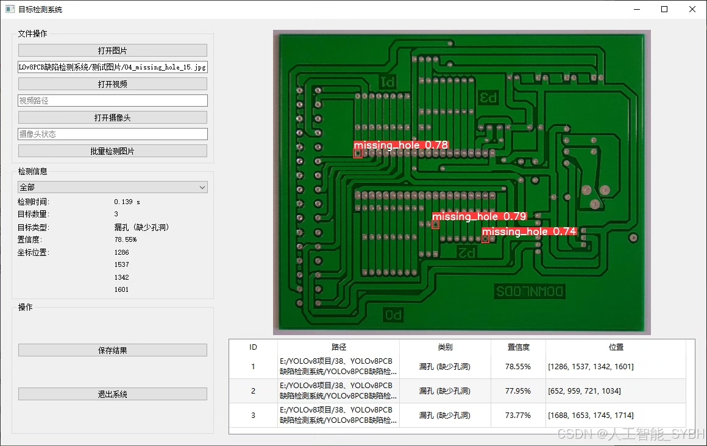
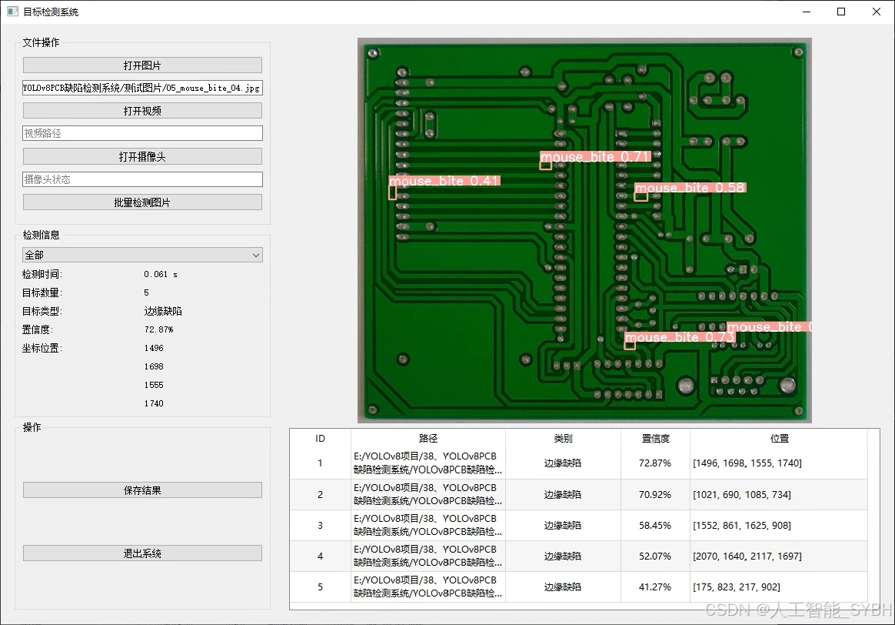
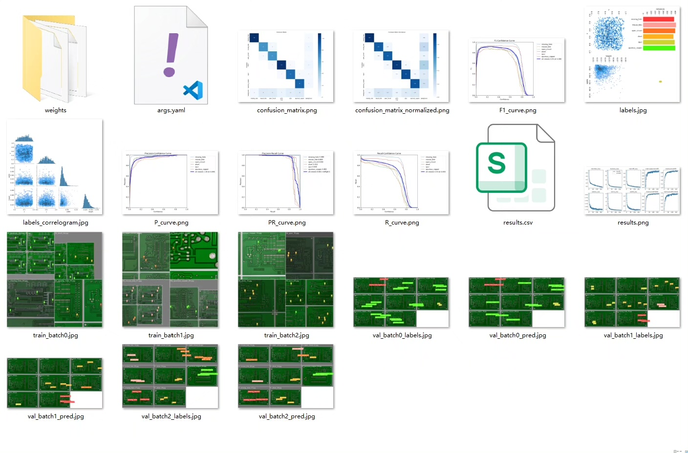
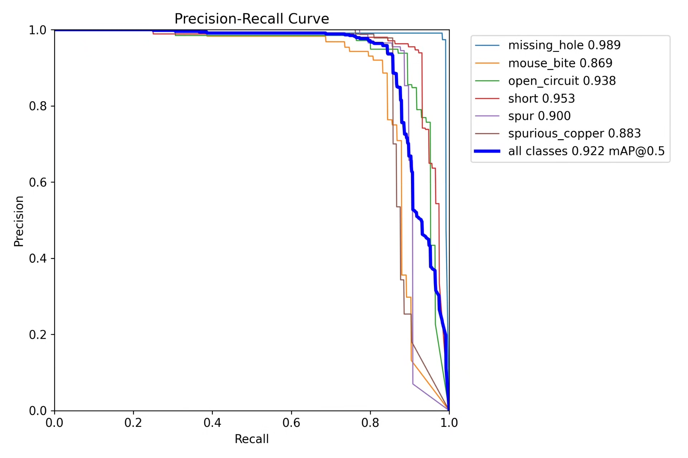
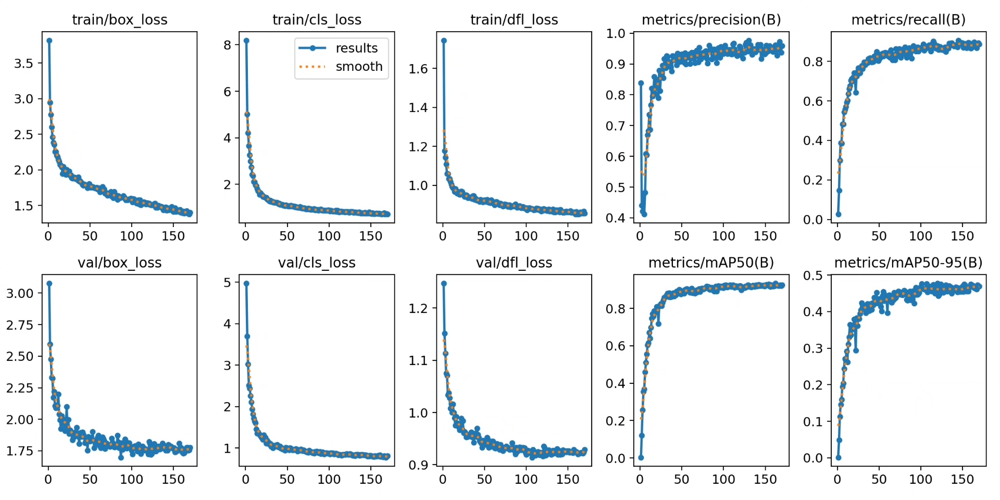
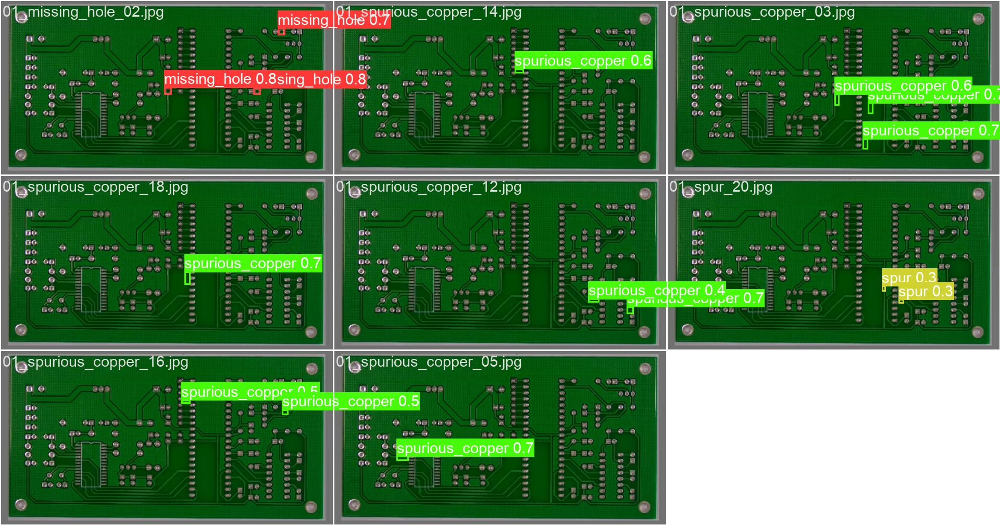
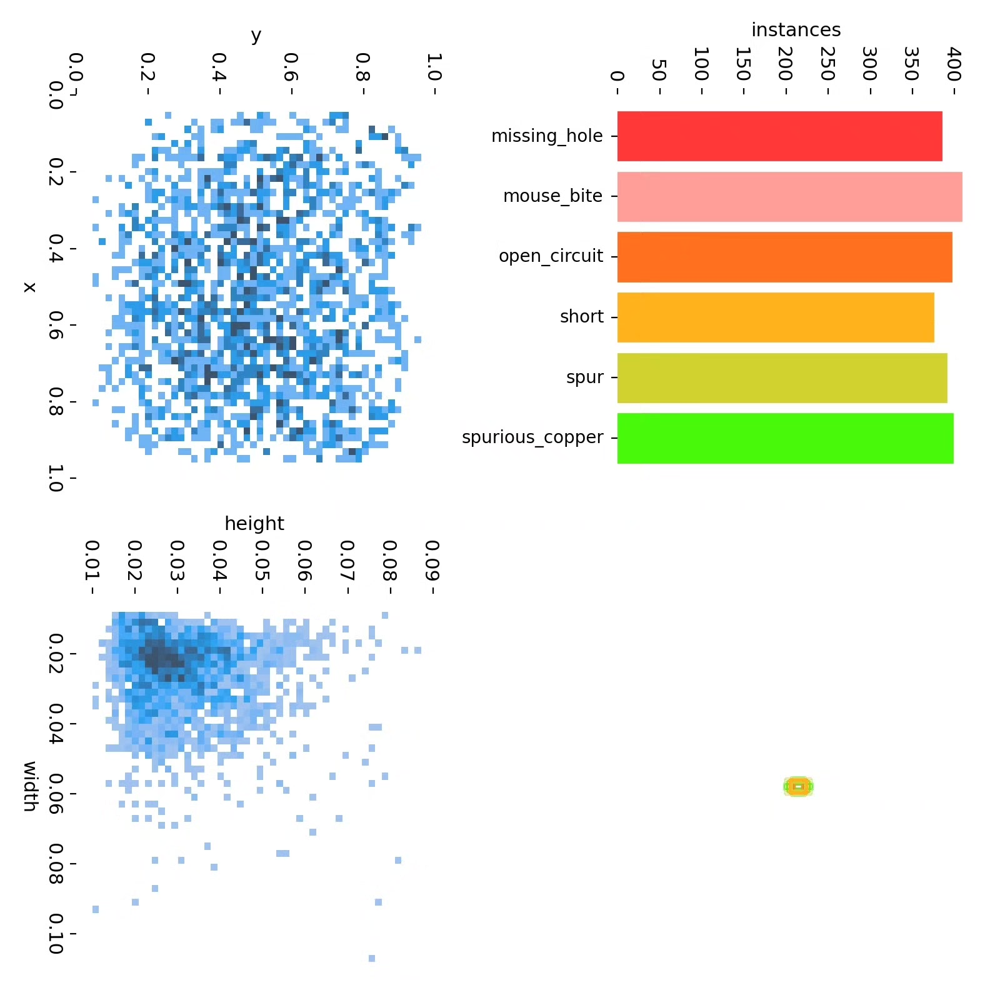
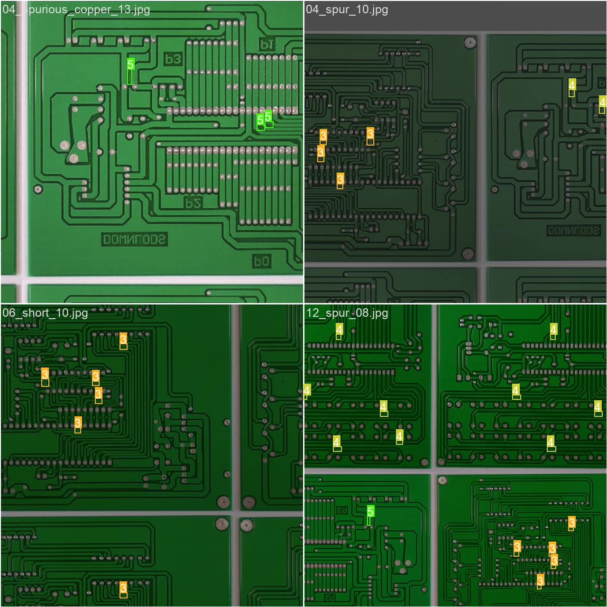

# Based on YOLOv8 deep learning for PCB board defect detection system (YOLO)

## Body

Based on the YOLOv8 deep learning algorithm, we have developed an efficient PCB board defect detection system. This project is specifically designed to identify and classify six common manufacturing defects on printed circuit boards (PCBs). The types of defects targeted by the system include: missing holes (missing_hole), mouse bite (mouse_bite), open circuit (open_circuit), short circuit (short), spur (spur), and spurious copper (spurious_copper). Through deep learning technology, the system achieves automated detection of PCB defects. This system can significantly improve the efficiency and accuracy of PCB quality inspection, reduce the cost of manual inspection, and provide an intelligent solution for quality control in the electronic manufacturing industry.

Our company's products have obtained the official commercial license certification from YOLO.
We offer after-sales service.
After payment, a WeChat account will be provided for any questions you may have.
Environmental configuration: A tutorial on environmental configuration will be provided, with WeChat available for答疑.
Remote installation service: If you need remote configuration, an additional fee of 69 is required.
If the configuration fails, all fees will be refunded (specially for old computers only refund installation fees).
Retraining dataset: After setting up the environment, you can train on your own computer.
If you need us to retrain, just pay 69 plus computing power fees (2.5 yuan/hour)

## Images

## Payment

Here is a pay link on Stripe ( https://buy.stripe.com/3cs8yP7sY87d0vu9AB ). Please contact me lonlonago@foxmail.com after funding $89, and I will send you a complete data files , thank you!

